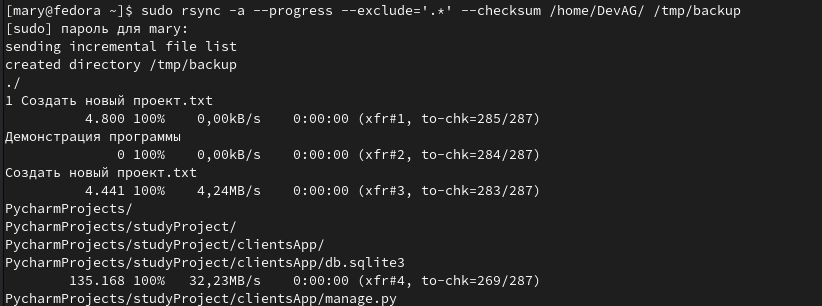
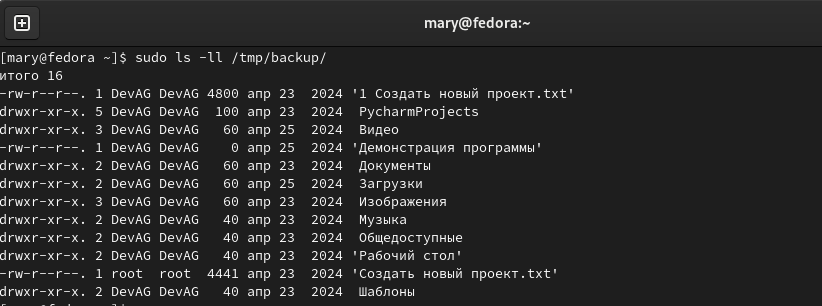
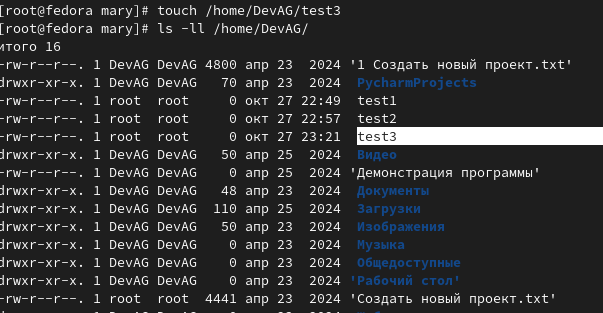
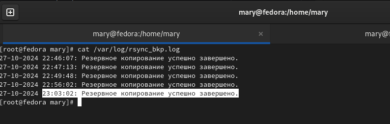
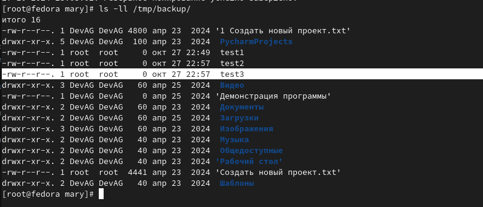

# Домашнее задание к занятию 3 "Резервное копирование" - Варфоломеева Марьяна

### Задание 1

Команда rsync:

```
rsync -a --progress --exclude='.*' --checksum . /tmp/backup
```
 - -a: архивный режим, который сохраняет права доступа, временные метки и рекурсивно копирует директории;
 - --exclude='.*': исключает скрытые файлы и директории;
 - --checksum: заставляет rsync проверять хэш-суммы всех файлов.

Выполнение команды:



В результате была создана зеркальная копия домашнего каталога в директории /tmp/backup :




### Задание 2


- Написать скрипт и настроить задачу на регулярное резервное копирование домашней директории пользователя 
с помощью rsync и cron.
- Резервная копия должна быть полностью зеркальной
- Резервная копия должна создаваться раз в день, в системном логе должна появляться запись об успешном или неуспешном выполнении операции
- Резервная копия размещается локально, в директории /tmp/backup
- На проверку направить файл crontab и скриншот с результатом работы утилиты.

Bash-скрипт который копирует домашнюю директорию в /tmp/backup/ и пишет логи с результатом выполнения rsync:

```
#!/bin/bash

SRC_DIR="/home/DevAG/"
BKP_DIR="/tmp/backup/"

TIMESTAMP=$(date "+%d-%m-%Y %H:%M:%S")

rsync -a --delete $SRC_DIR $BKP_DIR

if [ $? -eq 0 ]; then
	echo "$TIMESTAMP: Резервное копирование успешно завершено." >> /var/log/rsync_bkp.log
else
	echo "$TIMESTAMP: Ошибка при выполненни rsync" >> /var/log/rsync_bkp.log
fi
```

[Расписание crontab](./files/cron), которое выполняет копирование ежедневно в 23:03.

Для проверки выполнения задания по расписанию в домашнем каталоге был создан файл test3:



После 23:00 в логах можно увидеть, что задание по копированию было запущено по расписанию в 23:03:



Также видно, что резервная копия обновилась, так как появился файл test3:



